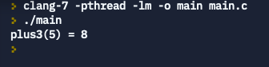

# 用 jit 的方法直接執行一個函數的機器碼
[修改自這裡呦～～](https://github.com/spencertipping/jit-tutorial/blob/master/jitproto.c)

## Code:
```
#include <stdio.h>
#include <stdlib.h>
#include <assert.h>
#include <string.h>
#include <sys/mman.h>

typedef int(*fn)(int);

int main() {
  char *memory = mmap(NULL, 
                      4096,
                      PROT_READ | PROT_WRITE | PROT_EXEC,
                      MAP_PRIVATE | MAP_ANONYMOUS,
                      -1,
                      0); 
  char code[] = {
    0x8d,0x47,0x03,0xc3
  };

  memcpy(memory, code, 4);
  fn f = (fn) memory;

  printf("plus3(5) = %d\n", (*f)(5));
  munmap(f, 4096);
  return 0;
}
```
## Output:


