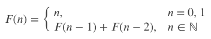

# MARS (Microprocessor without Interlocked Pipeline Stages)
## MIPS Assembler and Runtime Simulator.
## 是一種採取精簡指令集（RISC）的指令集架構（ISA）。
#
## MIPS 的通用暫存器:


# 實作
## 使用 MARS 實作階乘和費氏數列，參考網路上的程式碼
## 階乘(Factorial)


## 費氏數列(Fibonacci)



# 心得
```
MARS MIPS 模擬器是 MIPS 處理器的組合語言編輯器、模擬器，是由密蘇里州立大學開發的。
在過程中我可以很直觀地去了解記憶體跟暫存器是如何運作的，我覺得挺有趣的，之後感覺可以嘗試難一點的程式嘿嘿。
```
# Reference
[1].https://isite.tw/2015/03/17/13075

[2].https://mypaper.pchome.com.tw/zerojudge/post/1324165561

[3].https://courses.missouristate.edu/kenvollmar/mars/download.htm

[4].https://blueskyson.github.io/2020/04/05/mips-factorial-and-fibonacii/

[5].https://www.ece.ucdavis.edu/~chuah/rubinet/people/chuah/classes/eec70/eec70-f13/spimsal/MARS_bySticlaru.pdf

